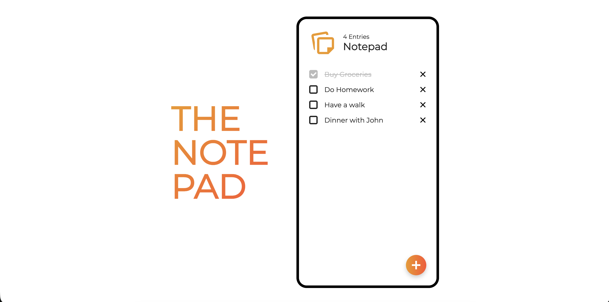

# 📝 notepad.js

 

 

**notepad.js** is a sleek, browser-based notepad that lets you write, save, and edit notes instantly — with a clean, distraction-free interface 🪶. No login, no servers, and complete privacy: your notes stay local in your browser.

## 🚀 Live Demo

No installation needed – it's 100% online!

Try it out here 👉 [Notepad by Faraaz Ansari](https://thefaraazansari.github.io/notepad.js/)

## 📸 Screenshot

## 🎯 Who is this for?

- Writers & students 📚  
- Developers & coders 💻  
- Anyone who needs quick, private notes ✍️  
- Fans of distraction-free tools 🌙

---
 
Made with ❤️ by **Faraaz Ansari**
